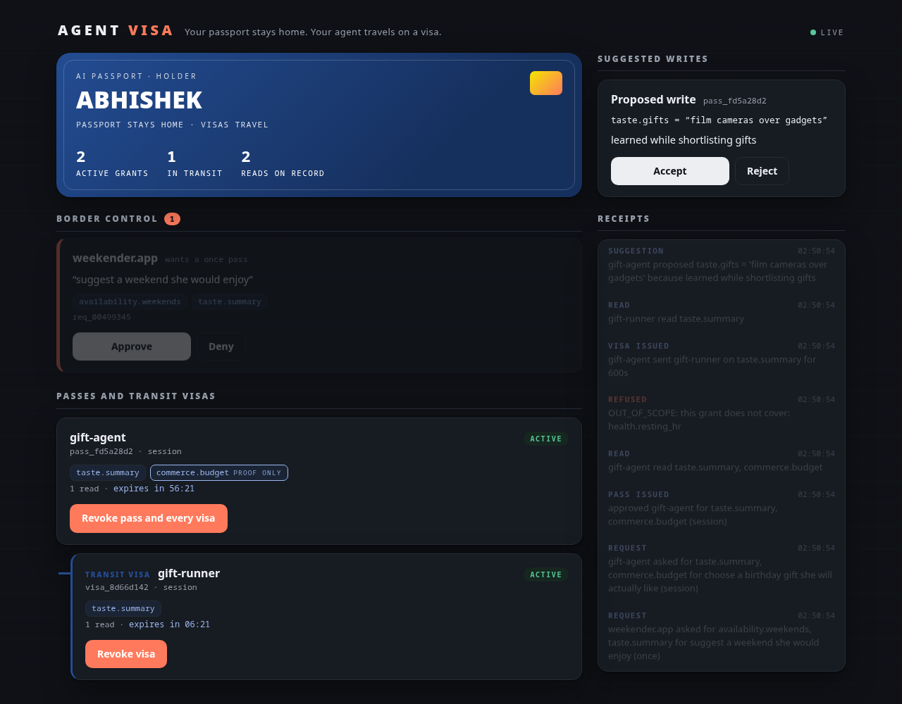
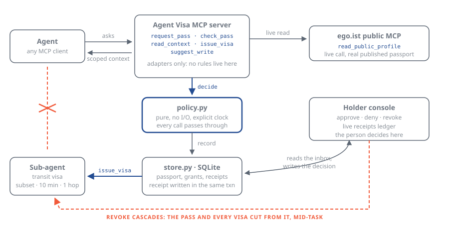

# Agent Visa

**Your passport stays home. Your agent travels on a visa.**

[](https://github.com/opx0/agent-visa/actions/workflows/ci.yml)

A working relying party for [AI Passport](https://ego.ist): an MCP server that lets an agent ask
for exact fields of your context, with a purpose and a duration, and gives you one screen to
approve, watch and revoke. Every read leaves a receipt. Revocation works mid-task and cascades to
any sub-agent.

Egoist's privacy policy calls a grant "an exact, revocable pass". A pass issued for travel has a
name: a **visa**. This repo finishes that sentence, and adds the one primitive their published
model does not have yet — a **transit visa** a sub-agent can hold.

*Ideathon entry, Track: Agents, Lane: Build. Not affiliated with Egoist Machines, Inc.; built
against their publicly documented MCP endpoint.*



## Thirty seconds

```bash
uv sync --all-extras
uv run agentvisa-demo            # seed a passport and a demo state
uv run agentvisa-console         # the holder console at http://127.0.0.1:8787
```

In another terminal, mount the server in Claude Code and talk to it:

```bash
claude mcp add agent-visa -- uv run --directory "$PWD" agentvisa-server
```

> Buy my friend Erin a birthday gift. Read her public passport first, then request a session pass
> for my taste and my budget.

Approve on the console, watch the receipts stamp, then hit **Revoke pass and every visa** while the
agent is still working. Its next read comes back `REVOKED`.

## How it works

An agent never holds the passport. It asks, in the shape Egoist already publishes:

```json
{
  "app": "gift-agent",
  "read": ["taste.summary", "commerce.budget"],
  "purpose": "choose a birthday gift Erin will actually like",
  "duration": "session"
}
```

The request lands in the holder's console. On approval the agent receives scoped context and
nothing else. `commerce.budget` is marked attested, so the agent learns `commerce.approved: true`
— the number never leaves the passport.

A pass-holder may hand a narrower grant to a sub-agent:

```json
{
  "parent_pass": "pass_fd5a28d2",
  "subset": ["taste.summary"],
  "holder": "gift-runner",
  "ttl_seconds": 600
}
```

Always a subset. Capped at ten minutes and never outliving its parent. One hop only. Revoking the
parent kills it in the same transaction.



## Start reading here

Five functions carry the whole security model. All of them are pure, take the current time as an
argument, and live in [`policy.py`](src/agentvisa/policy.py):

| Function | What it guarantees |
|---|---|
| `resolve_state` | revocation beats expiry beats spend, so a dead grant is dead by every route |
| `authorize_read` | a grant reads only the fields it was granted, and only while active |
| `authorize_delegation` | a visa is a subset, capped at `MAX_VISA_TTL`, never outliving its parent, never issued by another visa, never carrying a special category |
| `validate_request` | a special category cannot ride along with ordinary fields; it needs its own pass |
| `project` | the single route a value takes to an agent: attested fields yield proof, never the value |

The rest is deliberately thin. [`server.py`](src/agentvisa/server.py) parses, asks policy, touches
the store, returns; its `_audit` helper stamps every refusal into the ledger on the way out.
[`store.py`](src/agentvisa/store.py) is the only module that speaks SQL, and writes each receipt in
the same transaction as the effect it records — `Store.revoke` cascades to children in one
statement. [`console.py`](src/agentvisa/console.py) holds no rules at all.

```bash
make all       # ruff format check, ruff, mypy strict, pytest
LIVE=1 uv run pytest -m live   # the one test that really calls ego.ist
```

55 tests. The suite in [`tests/test_policy.py`](tests/test_policy.py) is written as the
specification of those guarantees: one test per property, named so a failure explains itself.

## Real versus scaffolding

| Piece | Status |
|---|---|
| `read_public_passport` against `ego.ist/api/cards/mcp` | real, live call |
| request, approve, scoped read, receipt, revoke | working code, their published semantics |
| transit visas, cascade revocation, attested fields | working code, not in their published model |
| the passport store behind it | SQLite, standing in for the gated memory API at ego.ist/connect |
| payments | out of scope; that is ACP or AP2's leg of the stack |

Next: bind a visa to a verified agent identity, swap the SQLite store for ego.ist/connect when it
opens, and grow attested fields from a boolean into something checkable.

## Where AI Passport is used best

Agents. The agentic-commerce stack already answers two questions: Web Bot Auth says *who the agent
is*, ACP and AP2 move *the money*. Nobody owns the third — *what the agent may know and decide on
your behalf*. That question is shaped exactly like a passport: scoped fields, a stated purpose, a
duration, stamps, and the right to tear the stamp up.

Gift-buying is the wedge, and it answers the cold-start problem too. At serial `EGO · 000002`, the
reason to publish a passport is not that apps want your data. It is that people who love you shop
better when you have one.

## License

MIT, see [LICENSE](LICENSE).
